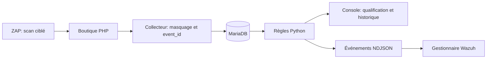

# Mini-SOC Web - Détection, qualification et corrections ciblées

Projet collectif EMSI 2025-2026, complété en octobre 2026 par des extensions de laboratoire préparées avec assistance d'outils IA. Une boutique fictive relie collecte HTTP, règles Python, console SOC et gestionnaire Wazuh.

**PHP · MariaDB · Python · Docker Compose · Wazuh · OWASP ZAP · MITRE ATT&CK**


## Chaîne et objectifs



- SQLi/XSS détectées indépendamment ; un user-agent d'outil ne déclenche plus une alerte à lui seul.
- Brute force : au moins cinq POST échoués sur `/login.php`, même source, dans 60 secondes ancrées sur l'événement. Les événements ultérieurs dans la même seconde sont exclus.
- Qualification : statut, justification, historique, session analyste et protection CSRF.
- Wazuh : règles indépendantes sur les événements JSON, rapprochement par `event_id`.
- Retest : comparaison de réponses HTTP et scan ZAP ciblé avant/après corrections SQLi/XSS.

## Lancement dans un laboratoire dédié

Prérequis : Docker Engine/Compose, Python 3 et PHP CLI pour générer le hash. Utiliser une copie dédiée et des comptes fictifs. La boutique conserve des vulnérabilités pédagogiques. Le Web est lié à **127.0.0.1:8086** ; la base n'a aucun port publié.

```bash
python scripts/prepare_env.py
docker compose up -d --build --wait db web siem
docker compose exec -T siem python tests/integration_lab.py
docker compose exec -T siem python tests/remediation_lab.py
```

Ouvrir `/soc/login.php`, compte `admin`, mot de passe aléatoire dans `runtime/soc-login.private`. `.env` et `runtime/` sont privés et exclus du dépôt. Le générateur refuse d'écraser une configuration existante ; sous Linux, il conserve l'UID/GID du propriétaire.

Les comptes MariaDB sont distincts : boutique, collecteur, moteur et console. Le moteur ne peut pas modifier les comptes clients. Les droits applicatifs de la console permettent de lire/ajouter l'historique, sans le supprimer. L'administrateur de la base conserve cette possibilité : ce n'est pas un journal immuable.

**Base neuve seulement :** `database/schema.sql` réinitialise les tables, lors de la création du volume Docker. Pour un ancien laboratoire MariaDB, sauvegarder et utiliser [la migration additive](database/migration_20261009.sql) sur une copie. Elle ne nettoie pas les secrets éventuellement présents dans les anciens journaux. Les scripts historiques `http_logs.sql`/`alerts.sql` ne migrent pas les tables existantes.

## Corrections ciblées et retest

```bash
MINISOC_HARDENED=1 docker compose up -d --no-deps --wait web
docker compose exec -T -e EXPECTED_HARDENED=1 siem python tests/remediation_lab.py
```

Sous PowerShell : définir `$env:MINISOC_HARDENED='1'` avant `docker compose up`. Les corrections concernent recherche, connexion et avis : requêtes préparées, encodage HTML et cookie client HttpOnly. Les comptes fictifs, les mots de passe clients en clair et d'autres fonctionnalités vulnérables restent pédagogiques. Une page corrigée peut encore recevoir une tentative et déclencher une alerte.

## Wazuh et ZAP

[Intégration Wazuh](integrations/wazuh/README.md) : gestionnaire local et collecte JSON ; aucun indexeur ni dashboard Wazuh dans la validation. Compose n'installe pas Wazuh automatiquement.

[Plan ZAP](integrations/zap/targeted.yaml) : URL interne fixe `http://web/search.php`, deux règles actives SQLi/XSS, durée bornée. L'image `bare` est complétée par les modules officiels nécessaires.

```bash
docker compose --profile audit build zap
docker compose --profile audit run --rm zap zap.sh -cmd -dir /zap/wrk/.zap -autorun /zap/plans/targeted.yaml
```

Conserver le rapport `runtime/zap/zap-targeted.json` sous un nom « avant » avant de relancer le même plan en mode corrigé. Le scan vise le laboratoire, sans tester la console SOC. Une absence d'alerte sur ce périmètre n'est pas une preuve de sécurité globale.

## Vérifications et limites

```bash
python -m pip install -r mini_siem/requirements.txt
python -m unittest discover -s mini_siem -p test_detection.py -v
python -m unittest discover -s tests -p test_regressions.py -v
```

La CI vérifie Python, la syntaxe PHP, Docker et les corrections ciblées. Wazuh/ZAP font l'objet de tests locaux distincts : [bilan et preuves](docs/VALIDATION_20261009.md).

Les champs usuels de secrets sont masqués avant stockage et export, sans garantir la reconnaissance de tout secret sous un nom arbitraire. Une attaque contenue uniquement dans un champ masqué n'est plus inspectée. Export NDJSON « au moins une fois » : un incident entre export et commit peut créer un rejeu identifiable par `event_id`. Rotation à 10 Mio et trois sauvegardes, sans garantie de durée. Les tables de journaux n'ont pas de purge automatique.

Le verrou MariaDB évite des cycles concurrents ; le dernier cycle est suivi dans `siem_health`. Le score pédagogique utilise la même formule PHP/Python ; ce n'est pas une cotation GRC du risque. Le mapping ATT&CK reste conditionnel : un motif XSS ne prouve pas une exécution JavaScript. Toutes les heuristiques du JSON historique ne sont pas implémentées. Aucun taux de détection, SLA ou résultat de production n'est annoncé.

- [Lecture analyste](docs/LECTURE_ANALYSTE.md)
- [Rapport collectif historique, 75 pages](docs/Rapport_Mini_SOC_Web.pdf)
- [Captures originales de juin 2026](docs/media/README.md)

## Équipe et attribution

**Anas El Karkouri, Omar Babba, Ilyas Ajelyan, Fadoua El-Allagui, Omar Gaga.** Encadrement : **Ismail Ait Lasri**, EMSI. Le rapport précise la répartition collective initiale. Les extensions d'octobre 2026 ne sont pas attribuées rétroactivement à chaque membre. Le dépôt constitue un support de pratique et d'explication en entretien.
