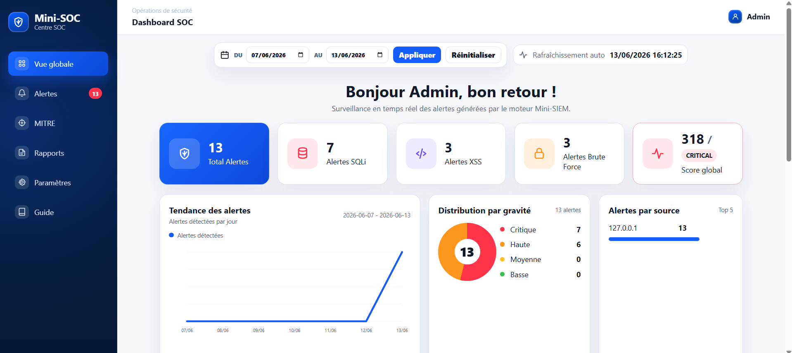
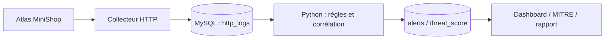

# Mini-SOC Web — Détection et supervision d’attaques web

Projet de fin d’année collectif EMSI, année 2025–2026. Un laboratoire relie une boutique de démonstration, un collecteur HTTP, un moteur de détection Python et une console SOC pour suivre le cycle requête → événement → alerte → analyse → réponse.

**PHP · MySQL/MariaDB · Python · Détection SQLi / XSS / brute force · MITRE ATT&CK · Dashboard SOC**



## Chaîne de supervision

- **Atlas MiniShop** : catalogue, panier, commandes, comptes et avis avec données fictives ; vulnérabilités conservées comme terrain d’exercice.
- **Collecteur HTTP** : IP source, méthode, URL, paramètres, user-agent, code de réponse et suivi du traitement.
- **Mini-SIEM** : détection SQLi/XSS par règles, seuil de connexions échouées, enrichissement et déduplication des alertes.
- **MITRE ATT&CK** : techniques, tactiques, sévérité et réponses recommandées associées aux règles du laboratoire.
- **Console SOC** : tendances, historique, filtres, détail des événements, statut de traitement et rapport imprimable en PDF.
- **Accès analyste** : sessions dédiées, protection CSRF, temporisation des tentatives et hash de mot de passe configuré localement.



## Installation locale

Utiliser PHP 8.1+, Python 3.12 et MySQL/MariaDB dans un environnement de laboratoire dédié. L’application accepte les connexions loopback et doit être lancée sur `127.0.0.1`. Le schéma `database/schema.sql` réinitialise les tables : l’importer exclusivement dans une base de démonstration séparée nommée `minisoc_shop`. Le schéma inclut les tables HTTP, alertes et scores. Les scripts séparés du dossier `database` servent à réinitialiser ces modules si nécessaire.

Configurer dans l’environnement `MINISOC_DB_HOST`, `MINISOC_DB_PORT`, `MINISOC_DB_USER`, `MINISOC_DB_PASSWORD` et `MINISOC_DB_NAME`. Générer votre propre hash avec `password_hash` PHP et le placer dans `MINISOC_SOC_PASSWORD_HASH` ; aucun hash de connexion de la machine d’origine n’est distribué.

```bash
python -m pip install -r mini_siem/requirements.txt
php -S 127.0.0.1:8086 -t .
# Dans un autre terminal :
python mini_siem/mini_siem.py
```

Ouvrir `http://127.0.0.1:8086/`, puis `/soc/login.php` avec l’utilisateur `admin` et le mot de passe correspondant à votre hash. Effectuer les exercices sur cette instance personnelle avec des comptes fictifs.

## Vérifications et démonstration

[Lecture analyste : qualification, limites des alertes et portée des tests](docs/LECTURE_ANALYSTE.md).

Six tests Python réussis localement, couvrant les règles et leurs contrôles négatifs, le seuil de connexions échouées et la stabilité du calcul du score. Les 28 fichiers PHP passent la vérification syntaxique. Le score total est calculé à partir des alertes enregistrées ; le recalcul d’une fenêtre ne réadditionne pas les mêmes alertes.

```bash
cd mini_siem
python -m unittest -v test_detection
```

- [Captures originales de la démonstration du 13 juin 2026](docs/media/README.md)
- [Rapport final — 75 pages](docs/Rapport_Mini_SOC_Web.pdf)

## Équipe

**Anas El Karkouri, Omar Babba, Ilyas Ajelyan, Fadoua El-Allagui et Omar Gaga**. Encadrement : **Ismail Ait Lasri**, EMSI. Le projet rassemble coordination/intégration, application web, collecte, détection, mapping et dashboard ; le rapport présente la répartition collective.
