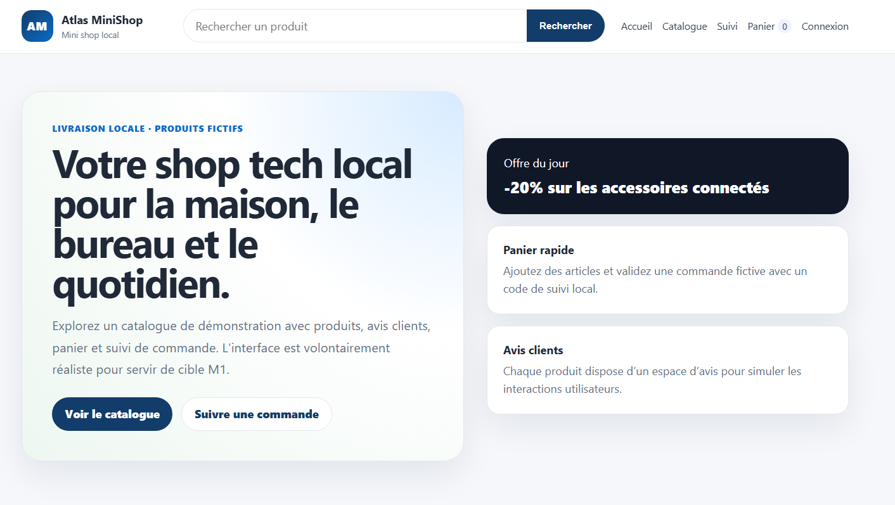
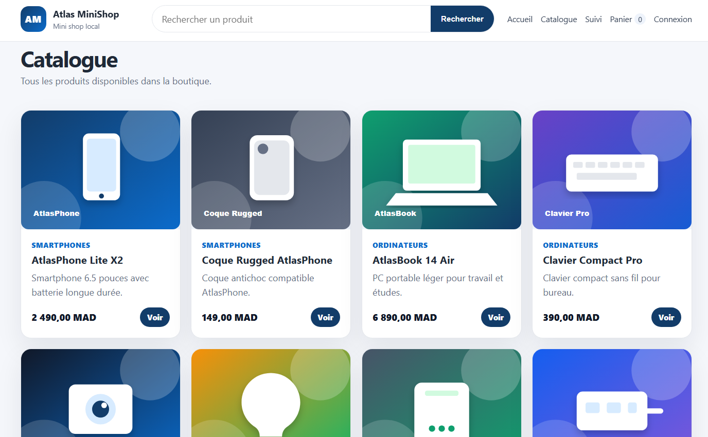
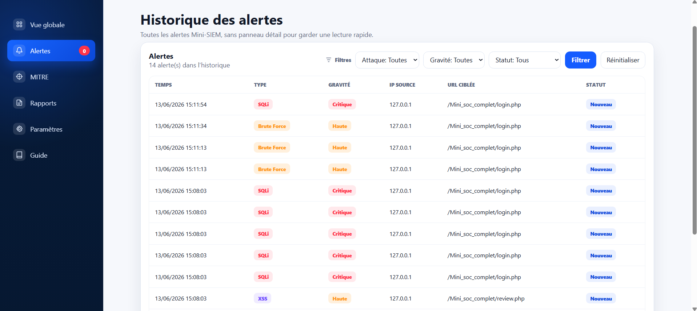
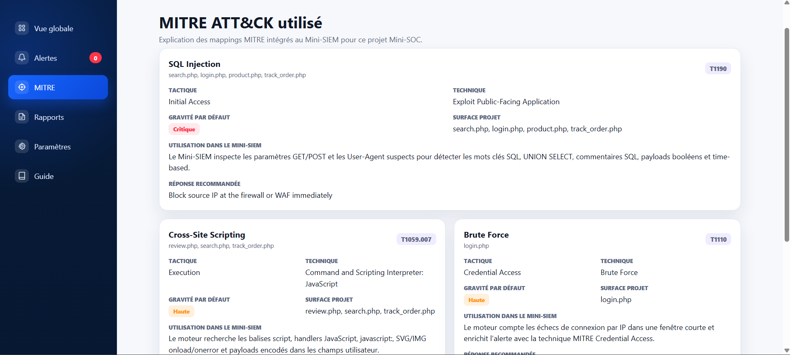
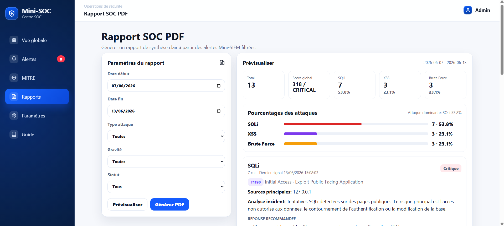

# Captures de démonstration

Captures originales fournies avec le projet, datées du 13 juin 2026. Elles illustrent les parcours du laboratoire et son interface.

## Accueil Atlas MiniShop

## Catalogue de produits fictifs

## Vue de supervision SOC

## Historique et filtrage des alertes

## Présentation des règles et des techniques MITRE

## Préparation du rapport SOC

